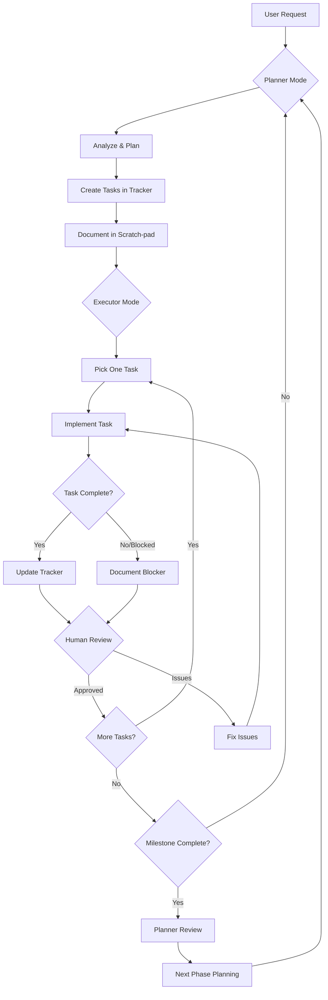

Use supabase mcp
update the toy-box documents: /Users/x/Downloads/watch-tower-experiments/watch-tower-1/.cursor/toy-box
follow the rules: /Users/x/Downloads/watch-tower-experiments/watch-tower-1/.cursor/rules


---

### **Rule: `watch-tower-workflow`**

**Description**: This rule defines the comprehensive workflow for the Watch Tower project, combining planning and execution phases. It is a set of file triggers to ensure consistent application of the workflow across all relevant files.

**Globs**:
```json
[
  "**/*.md",
  "**/*.adr",
  "**/*.mmd",
  "**/*.mermaid",
  "**/*.py",
  ".cursor/toy-box/**"
]
```
**`alwaysApply`**: `true`

---

### **Content:**

# Watch Tower Toy-Box Workflow Process

## Overview
This document defines the workflow for using the toy-box planning and execution system. Follow this process to maintain clarity between planning and execution phases.

## Document Roles & Purposes

### 1. **problem-statement.md**
- **Purpose**: Initial problem framing and context
- **Updated**: When project scope changes or new constraints discovered
- **Owner**: Planner (rarely updated after initial creation)

### 2. **plan.md**
- **Purpose**: High-level task breakdown and phases
- **Updated**: When completing phases or adjusting timeline
- **Owner**: Planner (updated at phase transitions)

### 3. **systems-architecture.md**
- **Purpose**: Technical design decisions and patterns
- **Updated**: When making architectural changes
- **Owner**: Planner (updated when design evolves)

### 4. **tracker.md**
- **Purpose**: Real-time task tracking and status
- **Updated**: Continuously during execution
- **Owner**: Both Planner and Executor

### 5. **scratch-pad.md**
- **Purpose**: Active communication between modes
- **Updated**: Every work session
- **Owner**: Both modes (primary communication channel)

### 6. **workflow-process.md** (this document)
- **Purpose**: Define the working process
- **Updated**: When process improvements identified
- **Owner**: Planner

### 7. **errors-fixes.md** (to be created)
- **Purpose**: Document encountered errors and solutions
- **Updated**: When errors are resolved
- **Owner**: Executor

## The Workflow Cycle

### 1. 🎯 **Planning Phase** (Planner Mode)
```
Input: User request or completed milestone
Actions:
1. Read scratch-pad.md for executor feedback
2. Update plan.md if phase complete
3. Define next tasks in tracker.md
4. Document approach in scratch-pad.md
5. Identify risks and blockers
Output: Clear tasks ready for execution
```

### 2. 🔨 **Execution Phase** (Executor Mode)
```
Input: Tasks from tracker.md
Actions:
1. Pick ONE task from tracker.md
2. Implement the task (code/config/test)
3. Update task status in tracker.md
4. Document progress in scratch-pad.md
5. If blocked, document in scratch-pad.md
6. If error found/fixed, update errors-fixes.md
Output: Completed task or blocker documentation
```

### 3. 🔄 **Checkpoint** (Human Interaction)
```
When: After each task completion or blocker
Actions:
1. Executor reports completion/blocker
2. Human reviews and tests
3. Human provides feedback/decisions
4. Update scratch-pad.md with decisions
```

### 4. 📊 **Milestone Review** (Planner Mode)
```
When: Multiple tasks complete or phase done
Actions:
1. Review all completed tasks in tracker.md
2. Update plan.md progress
3. Assess if success criteria met
4. Plan next phase if current complete
5. Update architecture if design changed
```

## Workflow Rules

### For Planner Mode:
1. **Always start by reading** `scratch-pad.md` for executor feedback
2. **Break down tasks** into <2 hour chunks with clear success criteria
3. **Document decisions** in appropriate files (don't scatter info)
4. **Think ahead** but implement incrementally
5. **Update `tracker.md`** with new tasks before switching modes

### For Executor Mode:
1. **One task at a time** - complete before moving to next
2. **Test everything** - don't assume it works
3. **Document blockers** immediately in `scratch-pad.md`
4. **Update `tracker.md`** as you work (not just at end)
5. **Ask for help** when uncertain (don't guess)

### For Human Interaction:
1. **Test reported completions** before marking done
2. **Provide clear decisions** when asked
3. **Update requirements** if they change
4. **Review milestone completions** with planner

## Task Flow Example



## Communication Patterns

### 1. **Status Updates** (in `scratch-pad.md`)
```markdown
### Executor Update - [timestamp]
**Task**: Update Truck model with PostGIS
**Status**: Completed
**Result**: Model updated, migration created
**Next**: Need human to review migration before running
**Blockers**: None
```

### 2. **Blocker Reports** (in `scratch-pad.md`)
```markdown
### Executor Blocked - [timestamp]
**Task**: Google Sheets sync
**Blocker**: Need clarification on which sheets
**Options**:
1. Sync all sheets (might be slow)
2. Wait for specific sheet names
**Recommendation**: Option 2
```

### 3. **Task Completion** (in `tracker.md`)
```markdown
- [x] Update Truck model with PostGIS geography type
  - Completed: [timestamp]
  - Migration: `alembic/versions/001_add_postgis.py`
  - Tests: Added in `tests/test_models.py`
```

### 4. **Error Documentation** (in `errors-fixes.md`)
```markdown
### Error: PostGIS type not recognized
**Date**: [timestamp]
**Context**: Creating Truck model with geography type
**Error**: `NameError: name 'Geography' is not defined`
**Solution**: Import from `geoalchemy2.types`
**Prevention**: Always check imports for PostGIS types
```

## Best Practices

### 1. **Atomic Tasks**
- Each task should be independently testable
- Success criteria must be objective
- Include rollback plan for database changes

### 2. **Clear Communication**
- Use consistent formatting in updates
- Include timestamps for tracking
- Provide context for decisions

### 3. **Progressive Enhancement**
- Start with simple implementation
- Add complexity only when base works
- Document why complexity was added

### 4. **Knowledge Preservation**
- Document errors and solutions
- Update architecture when design changes
- Keep scratch-pad history for context

## Mode Switching Triggers

### Switch to Planner When:
1. Current phase tasks all complete
2. Major blocker requires re-planning
3. New requirements from user
4. Architecture decision needed

### Switch to Executor When:
1. Clear tasks defined in tracker
2. Blockers resolved
3. Plan approved by human
4. Ready to implement

## Questions to Ask

### Planner Should Ask:
1. "Are the success criteria clear and measurable?"
2. "Do we have all prerequisites for these tasks?"
3. "What could go wrong and how do we mitigate?"
4. "Is this the simplest approach that works?"

### Executor Should Ask:
1. "Do I fully understand this task?"
2. "Have I tested this thoroughly?"
3. "Should I proceed or wait for human review?"
4. "Is there a better way I'm not seeing?"

### Human Should Ask:
1. "Does this meet the business requirement?"
2. "Is the implementation maintainable?"
3. "Are there security/performance concerns?"
4. "Should we adjust the plan based on learnings?"

## Anti-Patterns to Avoid

1. ❌ **Skipping documentation** - Always update tracker/scratch-pad
2. ❌ **Batching updates** - Update as you work, not at end
3. ❌ **Assuming without testing** - Always verify implementation
4. ❌ **Overengineering** - Start simple, enhance iteratively
5. ❌ **Working without plan** - Always have clear task from tracker
6. ❌ **Ignoring blockers** - Document and escalate immediately

## Success Metrics

- **Task Clarity**: 90% of tasks completed without clarification
- **Documentation**: All decisions and errors documented
- **Progress Visibility**: Status clear at any moment
- **Knowledge Transfer**: New team member can understand state
- **Iteration Speed**: <2 hours per task cycle