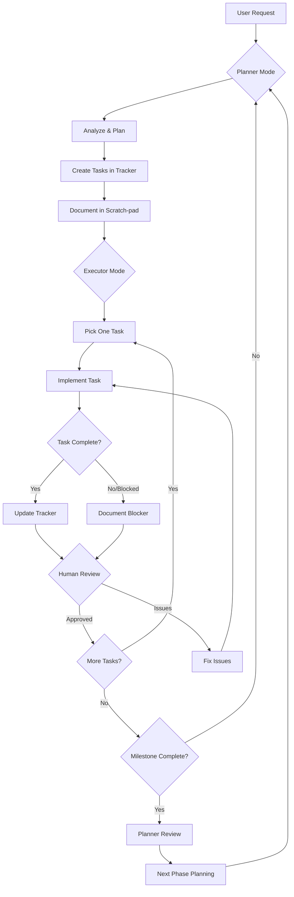

Use supabase mcp
update the toy-box documents: /Users/x/Downloads/watch-tower-experiments/watch-tower-1/.cursor/toy-box
follow the rules: /Users/x/Downloads/watch-tower-experiments/watch-tower-1/.cursor/rules

## 🎯 **CRITICAL PROJECT PRIORITY**

**Primary Value Proposition**: Truck locations come from LocoNav API. The most important functionality is LLMs using LocoNav APIs & webhooks as tools to answer natural language questions about fleet status.

**Core Use Case**: AI service must be able to query "Where is truck T11985LA?" and get real location data from LocoNav. Everything else is secondary infrastructure.

**Business Impact**: This natural language interface to fleet data is what transforms VPC's manual operations into AI-powered efficiency.

---

## 🤖 **AI Service Implementation Memory**

### OpenAI Responses API vs Chat Completions API
- **Current Implementation**: Uses Chat Completions API incorrectly labeled as Responses API
- **Target**: Migrate to proper Responses API for better state management and tool integration
- **Critical Security Issue**: `eval()` vulnerability on line 201 of ai_service.py

### API Differences
**Chat Completions:**
```python
response = client.chat.completions.create(
    model="gpt-4.1",
    messages=[...],
    tools=[...],
    max_tokens=2000
)
# Access: response.choices[0].message.content
```

**Responses API:**
```python
response = client.responses.create(
    model="gpt-4.1", 
    input=[...],  # NOT messages
    tools=[...],
    max_output_tokens=2000  # NOT max_tokens
)
# Access: response.output_text or response.output[0].content
```

### Key Implementation Requirements
1. Replace `eval()` with `json.loads()` for security
2. Change API endpoint from `chat.completions.create()` to `responses.create()`
3. Update parameter names: `messages` → `input`, `max_tokens` → `max_output_tokens`
4. Update response handling: `choices[0].message` → `output` 
5. Add state management with `previous_response_id`
6. Implement proper function calling for Responses API structure

### Function Calling Differences
- **Chat Completions**: `message.tool_calls` with `tool_call.function.name/arguments`
- **Responses**: `output` items with `type: "function_call"` and direct `name/arguments`

### Benefits of Migration
- Built-in state management
- Better event-driven architecture  
- Access to new tools (web_search_preview, file_search, computer_use)
- Future-proofing (Assistants API being deprecated)
- More robust multi-turn conversations

### Environment Configuration
- OpenAI API key configured correctly
- Model field empty (should use latest GPT-4 series)
- Temperature and token limits configured

---

## 📋 **Toy-Box Documentation Maintenance**

**RULE**: Always update toy-box documentation as we proceed with development.

### Required Updates for Every Major Milestone
When completing significant work, MUST update these files:
- `/Users/x/Downloads/watch-tower-experiments/watch-tower-1/.cursor/toy-box/plan.md`
- `/Users/x/Downloads/watch-tower-experiments/watch-tower-1/.cursor/toy-box/tracker.md`
- Any other relevant toy-box files for progress tracking

### What to Update
1. **Completion Status**: Mark features/phases as complete with evidence
2. **Performance Metrics**: Real benchmarks and measurements
3. **Technical Details**: Implementation specifics and architecture
4. **Next Priorities**: Clear roadmap for upcoming work
5. **Issues Resolved**: Document what was fixed and how

### Documentation Standards
- Keep existing format and style consistent
- Include actual performance data when available
- Mark major milestones clearly with timestamps
- Update percentage completions based on real progress
- Document both successes and any remaining issues

### Why This Matters
The toy-box serves as the project's source of truth for:
- Progress tracking and milestone achievements
- Technical decision documentation
- Performance benchmarks and metrics
- Integration roadmap and priorities

**Always update toy-box docs immediately after completing major work.**

---

## 🚨 **CRITICAL HALLUCINATION DISCOVERY**

**Date**: 2024-12-28  
**Issue**: LocoNav implementation was completely wrong - massive hallucination detected

### **What Was Wrong**:
```bash
# HALLUCINATED .env (WRONG)
LOCONAV_API_KEY=...           # Doesn't exist
LOCONAV_API_SECRET=...        # Doesn't exist  
LOCONAV_WEBHOOK_SECRET=...    # Not documented
LOCONAV_BASE_URL=https://api.loconav.com  # Wrong URL
```

### **Actual LocoNav Requirements** (from docs):
```bash
# CORRECT .env
LOCONAV_USER_TOKEN=PRJX5q4K5Yhn7FFWfuTx
LOCONAV_BASE_URL=https://api.a.loconav.com
```

### **Authentication Reality**:
- **ONLY** requires single User Token  
- Header: `User-Authentication: {{token}}`
- **NO API key/secret pattern**
- **NO webhook secrets in docs**

### **Critical Pattern Identified**:
**Problem**: Implementation claims completion without reading actual API documentation
**Impact**: Services won't work with real credentials due to wrong auth method & URL
**Risk**: Similar hallucinations likely exist in other "completed" services

### **NEW MANDATORY PROCESS**:
Before marking any external integration as "complete", MUST:
1. **Read the actual API docs thoroughly**
2. **Verify authentication method matches docs exactly**  
3. **Test with real credentials**
4. **Document what was hallucinated vs real**

**USER PROVIDED REAL TOKEN**: `LOCONAV_USER_TOKEN=PRJX5q4K5Yhn7FFWfuTx`

---

## 🧠 **Deeper Analysis: Validation Strategy**

### Current Reality Check Needed

**We claim these work but haven't tested**:
1. **LocoNav Service**: Can we actually fetch truck locations?
2. **API Endpoints**: Do `/api/v1/trucks` endpoints return data?
3. **Celery Tasks**: Are background jobs actually running?
4. **Redis Streams**: Are events publishing/consuming correctly?

### Validation Priority Order

**1. LocoNav API Integration** (CRITICAL)
- Test actual truck location retrieval
- Verify authentication works
- Check rate limits and error handling

**2. Core API Endpoints** (HIGH)
- Test truck CRUD operations
- Verify response formats match schemas
- Check database connectivity

**3. Background Processing** (MEDIUM)
- Test Celery task execution
- Verify scheduled tasks run
- Check Redis connectivity

**4. Event Streams** (LOW)
- Test Redis Streams publishing
- Verify consumer groups work
- Check event routing

### Decision Tree

```
IF LocoNav works + APIs work:
  → Fix AI service to use real data
  → Natural language queries become powerful

IF LocoNav broken OR APIs broken:
  → Fix foundation first
  → AI service needs working data layer

IF everything broken:
  → Rebuild from ground up
  → Start with LocoNav integration
```

---

## 🔧 **Celery Background Processing - Use & Need**

### Why Celery is Essential

**Problem**: Fleet operations require continuous background work that can't block user interactions:
- **Data Sync**: Google Sheets ↔ Database (every 15 minutes)
- **Analytics**: Daily fleet metrics calculation (6 AM Lagos time)
- **Monitoring**: Vehicle connectivity checks (every 5 minutes)
- **Alerts**: Proactive delay detection and Slack notifications
- **Cleanup**: Data archival and maintenance tasks

### How Celery Solves This

**Async Task Processing**: Offloads heavy work from API responses
```python
# User gets immediate response
@app.post("/trips")
async def create_trip(trip_data):
    # Quick database insert
    trip = await create_trip_record(trip_data)
    
    # Heavy LocoNav API calls happen in background
    sync_with_loconav.delay(trip.id)
    
    return {"trip_id": trip.id, "status": "created"}
```

**Scheduled Operations**: Reliable automation without human intervention
- **6 AM**: Generate daily analytics
- **Every 15 min**: Sync with Google Sheets
- **Every 5 min**: Check vehicle connectivity

**Fault Tolerance**: Retries, dead letter queues, monitoring
- Failed Google Sheets sync? Retry with exponential backoff
- LocoNav API down? Queue requests for later processing

---

## GitHub Integration
**IMPORTANT**: Do NOT use the GitHub MCP tool. Use GitHub CLI (`gh`) commands via Bash tool instead.


## Workflow Rules

### For Planner Mode:
1. **Always start by reading** `scratch-pad.md` for executor feedback
2. **Break down tasks** into <2 hour chunks with clear success criteria
3. **Document decisions** in appropriate files (don't scatter info)
4. **Think ahead** but implement incrementally
5. **Update `tracker.md`** with new tasks before switching modes

### For Executor Mode:
1. **One task at a time** - complete before moving to next
2. **Test everything** - don't assume it works
3. **Document blockers** immediately in `scratch-pad.md`
4. **Update `tracker.md`** as you work (not just at end)
5. **Ask for help** when uncertain (don't guess)

### For Human Interaction:
1. **Test reported completions** before marking done
2. **Provide clear decisions** when asked
3. **Update requirements** if they change
4. **Review milestone completions** with planner

## Task Flow Example



## Communication Patterns

### 1. **Status Updates** (in `scratch-pad.md`)
```markdown
### Executor Update - [timestamp]
**Task**: Update Truck model with PostGIS
**Status**: Completed
**Result**: Model updated, migration created
**Next**: Need human to review migration before running
**Blockers**: None
```

### 2. **Blocker Reports** (in `scratch-pad.md`)
```markdown
### Executor Blocked - [timestamp]
**Task**: Google Sheets sync
**Blocker**: Need clarification on which sheets
**Options**:
1. Sync all sheets (might be slow)
2. Wait for specific sheet names
**Recommendation**: Option 2
```

### 3. **Task Completion** (in `tracker.md`)
```markdown
- [x] Update Truck model with PostGIS geography type
  - Completed: [timestamp]
  - Migration: `alembic/versions/001_add_postgis.py`
  - Tests: Added in `tests/test_models.py`
```

### 4. **Error Documentation** (in `errors-fixes.md`)
```markdown
### Error: PostGIS type not recognized
**Date**: [timestamp]
**Context**: Creating Truck model with geography type
**Error**: `NameError: name 'Geography' is not defined`
**Solution**: Import from `geoalchemy2.types`
**Prevention**: Always check imports for PostGIS types
```

## Best Practices

### 1. **Atomic Tasks**
- Each task should be independently testable
- Success criteria must be objective
- Include rollback plan for database changes

### 2. **Clear Communication**
- Use consistent formatting in updates
- Include timestamps for tracking
- Provide context for decisions

### 3. **Progressive Enhancement**
- Start with simple implementation
- Add complexity only when base works
- Document why complexity was added

### 4. **Knowledge Preservation**
- Document errors and solutions
- Update architecture when design changes
- Keep scratch-pad history for context

## Mode Switching Triggers

### Switch to Planner When:
1. Current phase tasks all complete
2. Major blocker requires re-planning
3. New requirements from user
4. Architecture decision needed

### Switch to Executor When:
1. Clear tasks defined in tracker
2. Blockers resolved
3. Plan approved by human
4. Ready to implement

## Questions to Ask

### Planner Should Ask:
1. "Are the success criteria clear and measurable?"
2. "Do we have all prerequisites for these tasks?"
3. "What could go wrong and how do we mitigate?"
4. "Is this the simplest approach that works?"

### Executor Should Ask:
1. "Do I fully understand this task?"
2. "Have I tested this thoroughly?"
3. "Should I proceed or wait for human review?"
4. "Is there a better way I'm not seeing?"

### Human Should Ask:
1. "Does this meet the business requirement?"
2. "Is the implementation maintainable?"
3. "Are there security/performance concerns?"
4. "Should we adjust the plan based on learnings?"

## Anti-Patterns to Avoid

1. ❌ **Skipping documentation** - Always update tracker/scratch-pad
2. ❌ **Batching updates** - Update as you work, not at end
3. ❌ **Assuming without testing** - Always verify implementation
4. ❌ **Overengineering** - Start simple, enhance iteratively
5. ❌ **Working without plan** - Always have clear task from tracker
6. ❌ **Ignoring blockers** - Document and escalate immediately

## Success Metrics

- **Task Clarity**: 90% of tasks completed without clarification
- **Documentation**: All decisions and errors documented
- **Progress Visibility**: Status clear at any moment
- **Knowledge Transfer**: New team member can understand state
- **Iteration Speed**: <2 hours per task cycle