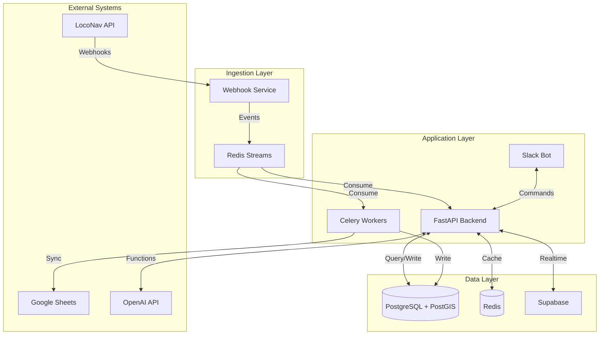

# Watch Tower Systems Architecture (O3 Enhanced)

## Overview

Watch Tower follows an event-sourced, async-first architecture optimized for real-time fleet management with AI-powered natural language interfaces.

## Architecture Principles

1. **Event Sourcing**: All state changes captured as events
2. **Async-First**: Non-blocking I/O for all operations
3. **Geography-Native**: PostGIS for all location data
4. **Function Calling**: Deterministic AI operations
5. **Microservices**: Loosely coupled, independently scalable

## System Components



## Data Flow Architecture

### 1. Event Ingestion Flow
```
LocoNav Webhook → Webhook Service → Validate HMAC → Redis Stream → Consumers
```

### 2. Command Processing Flow
```
Slack Command → Parse Intent → AI Function Call → Execute → Response
```

### 3. Data Sync Flow
```
Google Sheets → Batch Pull → Validate → Upsert → Broadcast Changes
```

## Database Schema (PostGIS Enhanced)

```sql
-- Trucks table with PostGIS
CREATE TABLE trucks (
    id UUID PRIMARY KEY DEFAULT gen_random_uuid(),
    truck_number VARCHAR(50) UNIQUE NOT NULL,
    loconav_vehicle_id VARCHAR(100) UNIQUE,
    current_location geography(Point,4326),
    last_location_update TIMESTAMPTZ,
    company VARCHAR(100),
    fleet_manager VARCHAR(100),
    status VARCHAR(50) DEFAULT 'operational',
    brand VARCHAR(50),
    trailer_size VARCHAR(20),
    operating_location VARCHAR(100),
    created_at TIMESTAMPTZ DEFAULT NOW(),
    updated_at TIMESTAMPTZ DEFAULT NOW()
);

-- Spatial index for fast geofence queries
CREATE INDEX idx_trucks_location ON trucks USING GIST(current_location);

-- Vehicle positions with geography
CREATE TABLE vehicle_positions (
    id UUID PRIMARY KEY DEFAULT gen_random_uuid(),
    truck_id UUID REFERENCES trucks(id),
    location geography(Point,4326) NOT NULL,
    timestamp TIMESTAMPTZ NOT NULL,
    speed DECIMAL(5,2),
    heading INTEGER,
    ignition BOOLEAN,
    created_at TIMESTAMPTZ DEFAULT NOW()
);

-- Geofences for terminals and client locations
CREATE TABLE geofences (
    id UUID PRIMARY KEY DEFAULT gen_random_uuid(),
    name VARCHAR(100) NOT NULL,
    type VARCHAR(50) NOT NULL, -- 'terminal', 'client', 'checkpoint'
    boundary geography(Polygon,4326) NOT NULL,
    created_at TIMESTAMPTZ DEFAULT NOW()
);

-- Events table for audit trail
CREATE TABLE events (
    id UUID PRIMARY KEY DEFAULT gen_random_uuid(),
    event_type VARCHAR(100) NOT NULL,
    entity_type VARCHAR(50) NOT NULL,
    entity_id UUID NOT NULL,
    payload JSONB NOT NULL,
    correlation_id UUID,
    created_at TIMESTAMPTZ DEFAULT NOW()
);
```

## Service Architecture

### 1. Webhook Service (Async)
```python
# Separate microservice for webhook ingestion
class WebhookService:
    - HMAC validation
    - Event publishing to Redis Streams
    - Dead letter queue for failures
    - Horizontal scaling with consumer groups
```

### 2. AI Service (OpenAI Responses API)
```python
# Function-calling pattern
class AIService:
    tools = [
        get_truck_location,
        create_trip,
        get_trip_status,
        generate_report
    ]
    
    async def process_query(query: str) -> Response:
        # Use OpenAI Responses API
        # Execute function calls
        # Return structured response
```

### 3. Background Tasks (Celery)
```python
# Scheduled tasks
@celery.task
async def sync_google_sheets():
    # Rate-limited batch sync
    # Every 15 minutes

@celery.task
async def generate_daily_report():
    # Run at 6 AM Lagos time
    # Send to Slack channel
```

## API Design

### RESTful Endpoints
```
GET    /api/v1/trucks
POST   /api/v1/trucks
GET    /api/v1/trucks/{id}
GET    /api/v1/trucks/{id}/location
GET    /api/v1/trucks/near?lat={lat}&lng={lng}&radius={radius}

POST   /api/v1/trips
GET    /api/v1/trips
PUT    /api/v1/trips/{id}/status
GET    /api/v1/trips/{id}/tracking

GET    /api/v1/analytics/daily
GET    /api/v1/analytics/tat
GET    /api/v1/analytics/utilization

POST   /api/v1/webhooks/loconav
POST   /api/v1/ai/query
```

### WebSocket Endpoints
```
WS     /ws/trucks/{id}/location
WS     /ws/trips/{id}/status
```

## Caching Strategy

### Redis Layers
1. **L1 Cache**: Hot data (truck locations) - 60s TTL
2. **L2 Cache**: Warm data (trip details) - 5m TTL
3. **L3 Cache**: Cold data (analytics) - 1h TTL

### Cache Patterns
```python
# Cache-aside pattern for reads
async def get_truck_location(truck_id: str):
    # Check Redis first
    cached = await redis.get(f"truck:{truck_id}:location")
    if cached:
        return cached
    
    # Query PostGIS
    location = await db.query(...)
    
    # Cache with TTL
    await redis.setex(f"truck:{truck_id}:location", 60, location)
    return location
```

## Security Architecture

### API Security
- JWT tokens for authentication
- Role-based access control (RBAC)
- API rate limiting per client
- Request signing for webhooks

### Data Security
- Encryption at rest (Supabase)
- TLS 1.3 for data in transit
- Secrets management via environment
- Audit logging for all operations

## Monitoring & Observability

### Structured Logging
```python
logger = structlog.get_logger()
logger.info("trip_created", 
    trip_id=trip.id,
    truck_id=truck.id,
    correlation_id=correlation_id
)
```

### Metrics Collection
- Response time percentiles (p50, p95, p99)
- Error rates by endpoint
- External API latencies
- Queue depths and processing times

### Distributed Tracing
- Correlation IDs across services
- OpenTelemetry integration
- Request flow visualization

## Scalability Considerations

### Horizontal Scaling
- Stateless API servers
- Redis Streams consumer groups
- Read replicas for analytics
- CDN for static assets

### Performance Targets
- API response time: <500ms p95
- Geofence queries: <50ms
- Event processing: <100ms
- Webhook ingestion: 1000 req/s

## Deployment Architecture

### Container Strategy
```yaml
services:
  api:
    replicas: 3
    resources:
      limits:
        memory: 2Gi
        cpu: 1000m
  
  webhook-service:
    replicas: 2
    resources:
      limits:
        memory: 1Gi
        cpu: 500m
  
  celery-worker:
    replicas: 4
    resources:
      limits:
        memory: 2Gi
        cpu: 1000m
```

### Environment Management
- Development: Local Docker Compose
- Staging: Kubernetes on GCP
- Production: Multi-region Kubernetes

## Technology Stack Summary

- **Language**: Python 3.12+
- **Framework**: FastAPI (async)
- **Database**: PostgreSQL 16 + PostGIS 3.4
- **Cache**: Redis 7.0
- **Queue**: Redis Streams
- **AI**: OpenAI GPT-4 (Responses API)
- **Monitoring**: Grafana + Prometheus
- **Logging**: Structured logs with Loki 