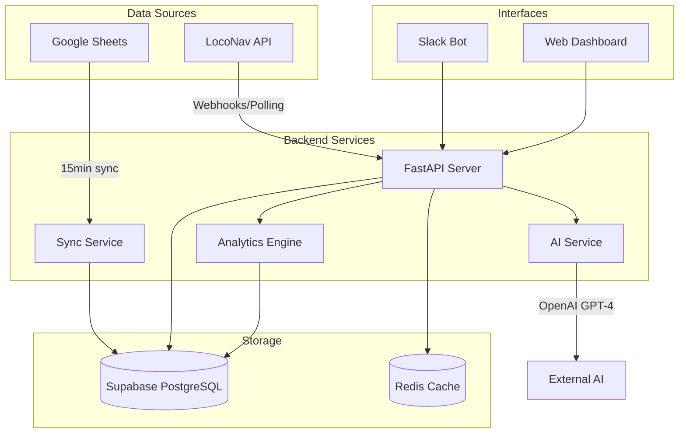

# Watch Tower - Technical Architecture

## 1. System Overview



## 2. Technology Stack

### Backend
- **Language**: Python 3.11+
- **Framework**: FastAPI
- **ORM**: SQLAlchemy 2.0
- **Task Queue**: Celery with Redis
- **API Documentation**: OpenAPI/Swagger

### Database
- **Primary**: PostgreSQL 15+ (via Supabase)
- **Cache**: Redis 7+
- **Vector Store**: pgvector (for future semantic search)

### AI/ML
- **LLM**: OpenAI GPT-4
- **Embedding**: OpenAI text-embedding-3-small
- **Framework**: LangChain

### Frontend (Phase 3)
- **Framework**: React 18+
- **Language**: TypeScript
- **State Management**: Zustand
- **UI Library**: Tailwind CSS + shadcn/ui
- **Charts**: Recharts

### Infrastructure
- **Containerization**: Docker
- **Orchestration**: Docker Compose (dev), Kubernetes (prod)
- **Monitoring**: Prometheus + Grafana
- **Logging**: ELK Stack
- **CI/CD**: GitHub Actions

## 3. Database Schema

```sql
-- Core Entities
CREATE TABLE organizations (
    id UUID PRIMARY KEY DEFAULT gen_random_uuid(),
    name VARCHAR(255) NOT NULL,
    type VARCHAR(50), -- 'transporter', 'client'
    created_at TIMESTAMP DEFAULT CURRENT_TIMESTAMP,
    updated_at TIMESTAMP DEFAULT CURRENT_TIMESTAMP
);

CREATE TABLE trucks (
    id UUID PRIMARY KEY DEFAULT gen_random_uuid(),
    truck_number VARCHAR(50) UNIQUE NOT NULL,
    loconav_vehicle_id VARCHAR(100) UNIQUE,
    company VARCHAR(100),
    fleet_manager VARCHAR(100),
    status VARCHAR(50) DEFAULT 'operational',
    brand VARCHAR(50),
    trailer_size VARCHAR(20),
    operating_location VARCHAR(100),
    created_at TIMESTAMP DEFAULT CURRENT_TIMESTAMP,
    updated_at TIMESTAMP DEFAULT CURRENT_TIMESTAMP
);

CREATE TABLE drivers (
    id UUID PRIMARY KEY DEFAULT gen_random_uuid(),
    name VARCHAR(255) NOT NULL,
    phone VARCHAR(20),
    has_smartphone BOOLEAN DEFAULT false,
    truck_id UUID REFERENCES trucks(id),
    created_at TIMESTAMP DEFAULT CURRENT_TIMESTAMP,
    updated_at TIMESTAMP DEFAULT CURRENT_TIMESTAMP
);

CREATE TABLE locations (
    id UUID PRIMARY KEY DEFAULT gen_random_uuid(),
    name VARCHAR(255) NOT NULL,
    type VARCHAR(50) NOT NULL, -- 'terminal', 'client'
    address TEXT,
    coordinates POINT,
    geofence_id INTEGER,
    city VARCHAR(100),
    state VARCHAR(100),
    created_at TIMESTAMP DEFAULT CURRENT_TIMESTAMP,
    updated_at TIMESTAMP DEFAULT CURRENT_TIMESTAMP
);

-- Trips
CREATE TABLE trips (
    id UUID PRIMARY KEY DEFAULT gen_random_uuid(),
    vpc_id VARCHAR(100) UNIQUE,
    loconav_trip_id VARCHAR(100) UNIQUE,
    truck_id UUID REFERENCES trucks(id),
    driver_id UUID REFERENCES drivers(id),
    client_id UUID REFERENCES organizations(id),
    pickup_location_id UUID REFERENCES locations(id),
    delivery_location_id UUID REFERENCES locations(id),
    container_no VARCHAR(50),
    cargo_type VARCHAR(50),
    weight_tons DECIMAL(10,2),
    status VARCHAR(50) DEFAULT 'scheduled',
    scheduled_departure TIMESTAMP,
    actual_departure TIMESTAMP,
    arrival_time TIMESTAMP,
    offload_time TIMESTAMP,
    created_at TIMESTAMP DEFAULT CURRENT_TIMESTAMP,
    updated_at TIMESTAMP DEFAULT CURRENT_TIMESTAMP
);

-- Real-time Tracking
CREATE TABLE vehicle_positions (
    id UUID PRIMARY KEY DEFAULT gen_random_uuid(),
    truck_id UUID REFERENCES trucks(id),
    timestamp TIMESTAMP NOT NULL,
    coordinates POINT NOT NULL,
    speed DECIMAL(5,2),
    heading INTEGER,
    ignition BOOLEAN,
    created_at TIMESTAMP DEFAULT CURRENT_TIMESTAMP
);

-- Analytics
CREATE TABLE daily_metrics (
    id UUID PRIMARY KEY DEFAULT gen_random_uuid(),
    date DATE NOT NULL,
    total_trips INTEGER DEFAULT 0,
    completed_trips INTEGER DEFAULT 0,
    average_tat_hours DECIMAL(10,2),
    fleet_utilization_percent DECIMAL(5,2),
    total_distance_km DECIMAL(10,2),
    created_at TIMESTAMP DEFAULT CURRENT_TIMESTAMP
);

-- Indexes
CREATE INDEX idx_trips_status ON trips(status);
CREATE INDEX idx_trips_scheduled ON trips(scheduled_departure);
CREATE INDEX idx_vehicle_positions_truck_time ON vehicle_positions(truck_id, timestamp DESC);
CREATE INDEX idx_locations_geofence ON locations(geofence_id);
```

## 4. API Design

### RESTful Endpoints

```yaml
# Trip Management
POST   /api/v1/trips                 # Create new trip
GET    /api/v1/trips                 # List trips with filters
GET    /api/v1/trips/{id}           # Get trip details
PUT    /api/v1/trips/{id}           # Update trip
DELETE /api/v1/trips/{id}           # Cancel trip

# Fleet Monitoring  
GET    /api/v1/trucks                # List all trucks
GET    /api/v1/trucks/{id}/location # Get current location
GET    /api/v1/trucks/{id}/status   # Get truck status
GET    /api/v1/trucks/at-location   # Trucks at specific location type

# Analytics
GET    /api/v1/analytics/daily      # Daily summary
GET    /api/v1/analytics/weekly     # Weekly summary
GET    /api/v1/analytics/truck/{id} # Truck performance

# AI Assistant
POST   /api/v1/ai/query             # Natural language query
POST   /api/v1/ai/create-trip       # AI-assisted trip creation

# Webhooks (from LocoNav)
POST   /webhooks/loconav/alert      # Receive alerts
POST   /webhooks/loconav/location   # Live location updates
```

### WebSocket Endpoints

```yaml
WS     /ws/trucks                   # Real-time truck updates
WS     /ws/trips/{id}              # Trip progress updates
```

## 5. Service Architecture

### 5.1 Core Services

```python
# services/loconav_service.py
class LocoNavService:
    """Handles all LocoNav API interactions"""
    - authenticate()
    - create_trip()
    - get_vehicle_location()
    - subscribe_to_alerts()
    - handle_webhook()

# services/sheets_service.py  
class SheetsService:
    """Google Sheets synchronization"""
    - sync_trucks()
    - sync_drivers()
    - sync_locations()
    - sync_trips()
    - handle_conflicts()

# services/ai_service.py
class AIService:
    """Natural language processing"""
    - parse_query()
    - generate_response()
    - extract_trip_details()
    - suggest_actions()

# services/analytics_service.py
class AnalyticsService:
    """Performance metrics calculation"""
    - calculate_tat()
    - generate_daily_summary()
    - analyze_delays()
    - predict_delays()
```

### 5.2 Background Tasks

```python
# Celery tasks
@celery.task
def sync_google_sheets():
    """Runs every 15 minutes"""
    
@celery.task
def poll_vehicle_locations():
    """Runs every 5 minutes"""
    
@celery.task
def generate_daily_report():
    """Runs at 6 AM daily"""
    
@celery.task
def cleanup_old_data():
    """Runs weekly"""
```

## 6. Security Architecture

### 6.1 Authentication & Authorization

```python
# JWT-based authentication
- Access tokens (15 min expiry)
- Refresh tokens (7 days)
- Role-based permissions

# API Key Management
- Separate keys per service
- Rate limiting per key
- Key rotation every 90 days
```

### 6.2 Data Security

```yaml
Encryption:
  - At rest: AES-256
  - In transit: TLS 1.3
  - Database: Transparent encryption

Access Control:
  - Row-level security in Supabase
  - API gateway rate limiting
  - IP whitelisting for webhooks

Compliance:
  - GDPR data handling
  - Audit logging
  - Data retention policies
```

## 7. Integration Patterns

### 7.1 LocoNav Integration

```python
# Webhook handler
@app.post("/webhooks/loconav/alert")
async def handle_loconav_webhook(
    request: Request,
    background_tasks: BackgroundTasks
):
    # Verify webhook signature
    # Parse event type
    # Process based on event
    # Update local database
    # Trigger notifications
```

### 7.2 Slack Bot Architecture

```python
# Event-driven Slack bot
@slack_app.message("where is")
async def handle_location_query(message, say):
    # Extract truck number
    # Query current location
    # Format response
    # Send to Slack

@slack_app.command("/vpc-trip")
async def handle_trip_command(ack, command):
    # Parse command
    # Validate inputs
    # Create trip
    # Return confirmation
```

## 8. Caching Strategy

### 8.1 Cache Layers

```yaml
L1 - Application Cache:
  - In-memory caching for hot data
  - 60 second TTL
  - Truck locations, active trips

L2 - Redis Cache:
  - Shared cache across instances
  - 5 minute TTL
  - Analytics data, user sessions

L3 - Database Materialized Views:
  - Pre-computed analytics
  - Hourly refresh
  - Historical summaries
```

### 8.2 Cache Invalidation

```python
# Event-based invalidation
- Trip status change → Clear trip cache
- New location update → Update position cache
- Sheet sync → Clear master data cache
```

## 9. Monitoring & Observability

### 9.1 Metrics

```yaml
Application Metrics:
  - Request rate/latency
  - Error rates
  - Cache hit rates
  - Queue lengths

Business Metrics:
  - Active trips
  - Average TAT
  - Fleet utilization
  - Alert frequency

Infrastructure Metrics:
  - CPU/Memory usage
  - Database connections
  - API rate limits
  - Storage usage
```

### 9.2 Logging

```python
# Structured logging
import structlog

logger = structlog.get_logger()

logger.info("trip_created", 
    trip_id=trip.id,
    truck=truck.number,
    user=current_user.email
)
```

## 10. Deployment Architecture

### 10.1 Development Environment

```yaml
docker-compose.yml:
  services:
    api:
      build: ./backend
      ports: ["8000:8000"]
    
    postgres:
      image: postgres:15
      
    redis:
      image: redis:7
      
    celery:
      build: ./backend
      command: celery worker
```

### 10.2 Production Environment

```yaml
Kubernetes Deployment:
  - API: 3 replicas with HPA
  - Workers: 2 replicas
  - Redis: Cluster mode
  - Database: Managed Supabase
  
Load Balancing:
  - Nginx ingress controller
  - SSL termination
  - Rate limiting
  
Monitoring:
  - Prometheus metrics
  - Grafana dashboards
  - Alert manager
```

## 11. Disaster Recovery

### 11.1 Backup Strategy

```yaml
Database:
  - Continuous replication
  - Daily snapshots
  - 30-day retention

Application Data:
  - Google Sheets as source of truth
  - S3 backup for uploads
  - Configuration in Git

Recovery Objectives:
  - RTO: 2 hours
  - RPO: 15 minutes
```

### 11.2 Failover Procedures

```yaml
Primary Region Failure:
  1. DNS failover to secondary
  2. Promote read replica
  3. Update service configs
  4. Verify integrations

Service Degradation:
  - Fallback to cached data
  - Queue writes for replay
  - Notify operations team
```

## 12. Performance Optimization

### 12.1 Database Optimization

```sql
-- Partitioning for large tables
CREATE TABLE vehicle_positions_2024_q1 
PARTITION OF vehicle_positions
FOR VALUES FROM ('2024-01-01') TO ('2024-04-01');

-- Efficient queries
CREATE INDEX CONCURRENTLY idx_trips_active 
ON trips(status) 
WHERE status IN ('scheduled', 'ongoing');
```

### 12.2 API Optimization

```python
# Batch processing
@app.post("/api/v1/trucks/batch-location")
async def get_batch_locations(truck_ids: List[str]):
    # Single query for multiple trucks
    # Parallel API calls to LocoNav
    # Aggregate results
```

## 13. Future Architecture Considerations

### 13.1 Scalability

```yaml
Microservices Migration:
  - Trip Service
  - Fleet Service
  - Analytics Service
  - Notification Service

Event Streaming:
  - Apache Kafka for events
  - Event sourcing for trips
  - CQRS for analytics
```

### 13.2 Advanced Features

```yaml
ML Pipeline:
  - Route optimization
  - Delay prediction
  - Anomaly detection
  - Demand forecasting

Real-time Analytics:
  - Apache Flink streaming
  - ClickHouse for OLAP
  - Superset dashboards
```
